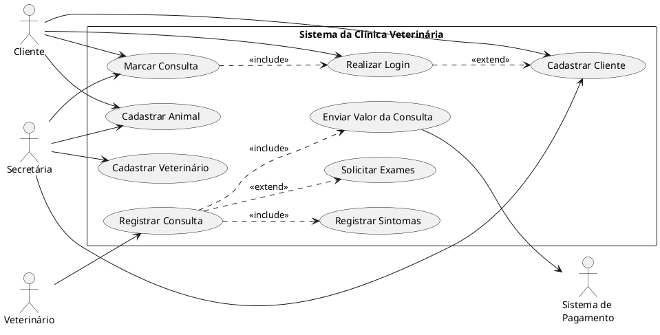

# Atividade — Diagrama de Casos de Uso: Sistema para Clínica Veterinária

## Enunciado (resumo)

O cliente pode marcar consulta on-line (mediante login/cadastro) ou presencialmente,
sendo neste caso atendido pela secretária, que também cadastra clientes, animais e
veterinários. Na data da consulta, o veterinário atende o cliente e o animal, registra
os sintomas informados, pode solicitar exames para a próxima sessão e, ao final, o
valor da consulta é enviado ao Sistema de Pagamento da clínica.

---

## Passo 1 — Identificação dos Atores

| Ator | Tipo | Justificativa |
|---|---|---|
| **Cliente** | Primário | Interage diretamente com o sistema para se cadastrar, logar, marcar consulta e informar sintomas. |
| **Secretária** | Primário | Cadastra clientes, animais e veterinários; marca consultas presenciais. |
| **Veterinário** | Primário | Realiza a consulta, registra dados/sintomas e pode solicitar exames. |
| **Sistema de Pagamento** | Secundário (sistema externo) | Recebe o valor da consulta ao final do atendimento — não é usuário humano, mas um sistema com o qual o sistema da clínica troca informação. |

---

## Passo 2 — Identificação dos Casos de Uso

1. **Realizar Login**
2. **Cadastrar Cliente**
3. **Cadastrar Animal**
4. **Marcar Consulta**
5. **Cadastrar Veterinário**
6. **Registrar Consulta** (dados gerais/diagnóstico da sessão)
7. **Registrar Sintomas**
8. **Solicitar Exames**
9. **Enviar Valor da Consulta** (registrar pagamento)

---

## Passo 3 — Relacionamentos

### 3.1 Ator × Caso de Uso

| Caso de Uso | Cliente | Secretária | Veterinário | Sistema de Pagamento |
|---|:---:|:---:|:---:|:---:|
| Realizar Login | X | | | |
| Cadastrar Cliente | X *(auto-cadastro on-line)* | X *(presencial)* | | |
| Cadastrar Animal | X¹ | X | | |
| Marcar Consulta | X *(on-line)* | X *(presencial)* | | |
| Cadastrar Veterinário | | X | | |
| Registrar Consulta | | | X | |
| Registrar Sintomas | | | X | |
| Solicitar Exames | | | X | |
| Enviar Valor da Consulta | | | | X *(recebe)* |

¹ Premissa: no cadastro on-line, presume-se que o cliente também cadastra seu(s) animal(is), já que é necessário ter um animal cadastrado para marcar consulta (ver seção de premissas).

### 3.2 Relacionamentos entre Casos de Uso

| Relação | Caso de Uso Base | Caso de Uso Relacionado | Justificativa |
|---|---|---|---|
| `<<include>>` | Marcar Consulta | Realizar Login | No fluxo on-line, o cliente precisa estar autenticado antes de marcar a consulta. |
| `<<extend>>` | Realizar Login | Cadastrar Cliente | Ponto de extensão condicional: só ocorre se o cliente tentar logar e ainda não estiver cadastrado. |
| `<<include>>` | Registrar Consulta | Registrar Sintomas | O veterinário sempre registra os sintomas informados pelo cliente como parte da consulta. |
| `<<extend>>` | Registrar Consulta | Solicitar Exames | Ponto de extensão condicional: só ocorre quando o diagnóstico exige exames complementares. |
| `<<include>>` | Registrar Consulta | Enviar Valor da Consulta | Ao final de toda consulta, o valor é obrigatoriamente enviado ao Sistema de Pagamento. |

---

## Diagrama (código PlantUML)

Cole o código abaixo em https://www.plantuml.com/plantuml/uml/ (ou na extensão PlantUML do VS Code/IntelliJ) para gerar o diagrama visual em notação UML padrão.

---

## Premissas assumidas

- No cadastro on-line, o cliente também cadastra seu(s) animal(is), pois é necessário ter um animal vinculado para marcar consulta.
- A secretária é tratada como usuária já autenticada por outro mecanismo (login administrativo, fora do escopo do enunciado), por isso não foi vinculada ao caso de uso "Realizar Login".
- "Registrar Consulta" pode se repetir em múltiplas sessões para o mesmo animal, conforme indicado no enunciado ("o animal pode ter que passar por várias sessões de consultas").
